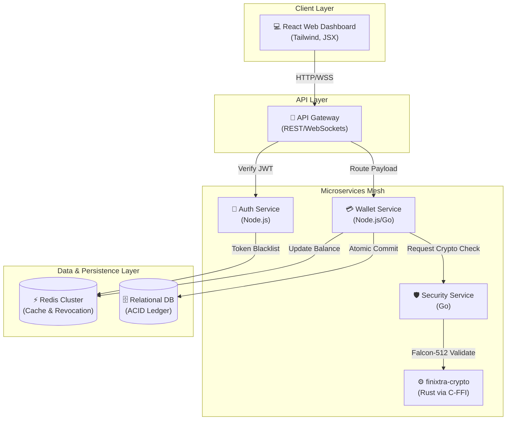
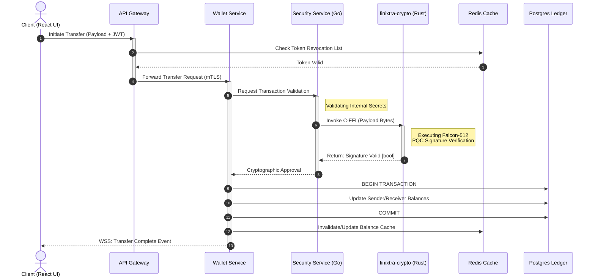
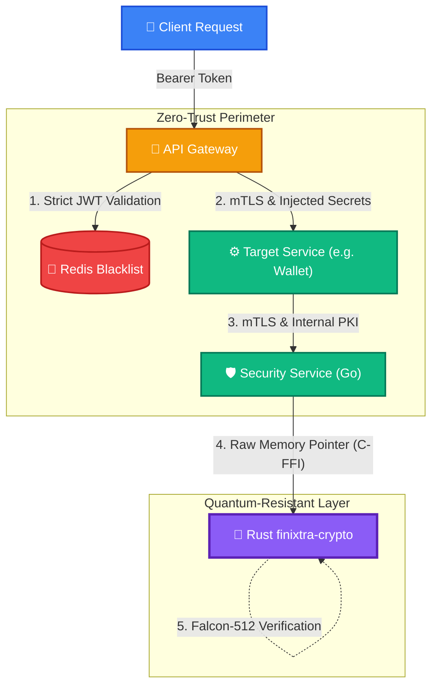

# PROJECT REPORT

## 1. Title of the Project
**Finixtra: Post-Quantum Fintech Mesh Platform**

## 2. Introduction
- **What the project is about:** Finixtra is a next-generation fintech infrastructure (fintech mesh) engineered to facilitate high-speed, highly secure, and globally distributed financial transactions.
- **Why it is needed:** As quantum computing advances, traditional cryptographic standards (like RSA and ECC) are becoming vulnerable. The financial industry requires robust, scalable, and quantum-resistant architectures to protect against future cryptographic threats while maintaining seamless, low-latency microservice communication.
- **Basic idea of the system:** A distributed microservices-based platform comprising specialized, decoupled services for authentication, multi-currency wallet management, asset portfolio analytics, KYC (Know Your Customer) portals, and security. The platform's defining characteristic is its fortification with post-quantum cryptography (PQC) to guarantee absolute transaction integrity.

## 3. Objectives
- **Main purpose of the project:** To build an institutional-grade financial transaction platform capable of handling real-time data, high-frequency secure asset transfers, and complex multi-currency portfolios.
- **What you want to achieve:**
  - Implement instantaneous, seamless wallet transfers across multiple asset classes.
  - Deliver real-time dashboard analytics and comprehensive asset portfolio tracking.
  - Achieve quantum-resistant transaction integrity using advanced cryptographic algorithms.
  - Establish reliable, zero-trust cross-service authentication within the microservices mesh.
  - Automate security validation and testing through an autonomous engineering loop.

## 4. Tools & Technologies Used
- **Programming Languages:**
  - JavaScript/TypeScript (Node.js for backend services, React for the frontend web application)
  - Go (Golang) for high-performance security microservices
  - Rust for memory-safe, low-level cryptographic libraries (`finixtra-crypto`)
- **Software/Tools:**
  - Visual Studio Code (IDE)
  - Redis (for distributed caching and high-speed ledger read operations)
  - Docker & Vercel (for containerization and deployment environments)
  - Tailwind CSS (for modern UI styling in the web app)
- **Database:** Relational database architecture coupled with a Redis caching layer for optimized high-speed ledger performance and token revocation storage.

## 5. System Architecture
- **Microservices Mesh Pattern:** Finixtra is built on a highly scalable, decoupled microservices architecture. Each bounded context (e.g., Auth, Wallet, Security) runs as an independent service communicating via internal REST APIs and optimized RPC calls.
- **Frontend & Backend Decoupling:** The presentation layer is a React Single Page Application (SPA) that communicates asynchronously with the backend API gateway, ensuring the user interface remains responsive under heavy network and data processing loads.
- **Hybrid Data Layer:** The architecture utilizes a distributed Redis cache sitting in front of a primary relational database. This hybrid approach guarantees strict ACID compliance for financial ledger writes while simultaneously enabling sub-millisecond read speeds for balance queries and rapid authorization checks.

### Architecture Diagram

## 6. System Workflow
- **User Authentication Flow:** 
  1. A user accesses the React frontend (e.g., via the KYC Portal or login screen).
  2. The Auth Service verifies credentials and issues a JSON Web Token (JWT).
  3. Every subsequent request passes through an API gateway where the JWT is validated against a real-time, Redis-backed revocation list.
- **Transaction Processing Flow:** 
  1. The user initiates an asset transfer via the `MultiCurrencyWallet` interface.
  2. The frontend routes the request to the Wallet Service backend.
  3. The Wallet Service intercepts the request and demands cryptographic validation from the Security Service.
  4. The Go-based Security Service calls the low-level Rust `finixtra-crypto` library via a C-Foreign Function Interface (C-FFI) to verify the transaction payload using Falcon-512 algorithms.
  5. Upon successful mathematical verification, the Wallet Service atomically updates the ledger in the database, syncing the new balance to the Redis cache.
  6. The React frontend receives a real-time event confirmation, updating the Dashboard and Asset Portfolio dynamically.

### Transaction Sequence Diagram

## 7. Security
- **Post-Quantum Cryptography (PQC):** At the absolute core of Finixtra's security posture is its integration of Falcon-512 signature algorithms. By utilizing a memory-safe Rust library bridged directly into the Go security service, all high-value transactions are cryptographically sealed against the decryption capabilities of future quantum computers.
- **Zero-Trust Internal Network:** The fintech mesh operates on a zero-trust model. All service-to-service communication requires strict authentication. Microservices constantly validate internal secrets and TLS-encrypted payloads, ensuring that a localized compromise in one service does not expose the broader financial network.
- **Immediate Token Revocation:** Session security is strictly enforced by a centralized, high-speed Redis token blacklist. If anomalous behavior is detected, user or service tokens can be instantaneously revoked across the entire distributed network, cutting off access without waiting for natural JWT expiration times.

### Security Architecture Diagram

## 8. Current Progress
- **What has been completed:** The core fintech infrastructure is fully functional. The Auth and Wallet microservices, along with the React web dashboard (including KYC, MultiCurrencyWallet, and AssetPortfolio components), are established and communicating effectively. Internal security secrets, strict service-to-service authentication protocols, and Redis-backed token revocation have been successfully implemented. Database caching mechanisms are actively optimizing ledger performance.
- **What is still remaining:** Finalizing the intricate C-FFI layer integration to bridge the Rust-to-Go post-quantum cryptography module. Additionally, comprehensive production-grade environment hardening and the deployment of an automated, autonomous testing loop across all microservices are in progress.

## 9. Problems Faced
- **Cross-Language Cryptographic Integration:** Bridging the Go-based security service with the Rust `finixtra-crypto` library via C-FFI presented significant environmental dependency and compilation challenges. Ensuring memory safety and correct data type mapping between Go and Rust required extensive debugging.
- **Service-to-Service Security:** Enforcing strict zero-trust authentication between internal microservices without introducing unacceptable latency or performance degradation necessitated the implementation of highly optimized, cached secret validation.
- **Ledger Optimization:** Balancing the need for strict ACID compliance in financial transactions with the requirement for high-speed read performance required careful tuning of the Redis caching layer to prevent data staleness or race conditions.

## 10. Future Work
- **Features to be added:** Complete, production-wide deployment of Falcon-512 PQC transaction signing. Expansion of the interactive Loyalty Program and deeper integration of predictive analytics into the Asset Portfolio dashboard.
- **Improvements planned:** The implementation of a fully autonomous system telemetry and engineering loop to proactively identify and resolve bottlenecks. Further optimization of the distributed caching architecture to harden the infrastructure against complex, high-concurrency load scenarios.

## 11. Conclusion
- **What the project aims to achieve overall:** The Finixtra platform aims to fundamentally redefine secure financial infrastructure by merging a highly scalable, flexible microservice mesh with state-of-the-art quantum-resistant cryptography, ensuring that digital assets remain secure long into the post-quantum era.
- **Current status summary:** The platform has achieved a stable, functional state across its full stack and is currently undergoing advanced security architecture evolution, focusing on PQC integration and rigorous production hardening to prepare for enterprise-level deployment.
